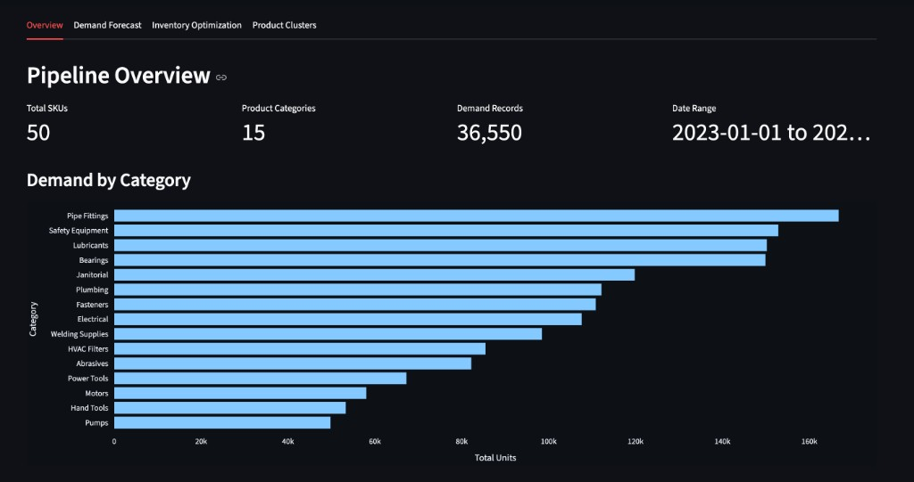
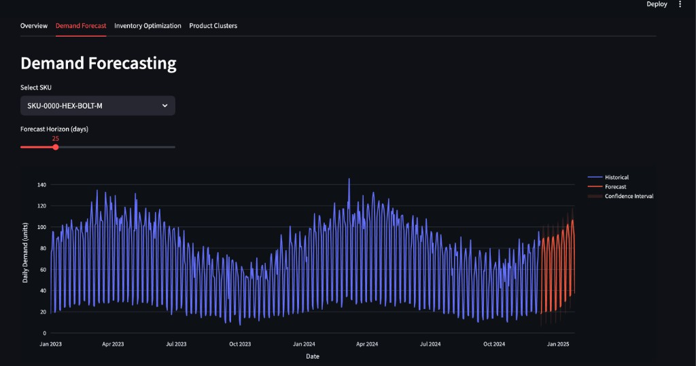
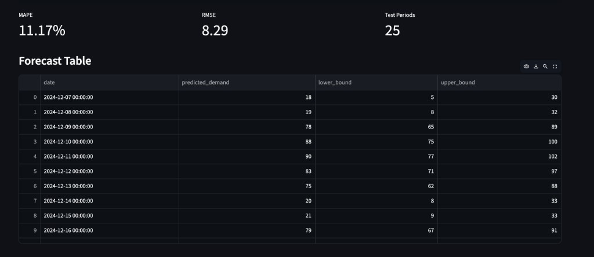
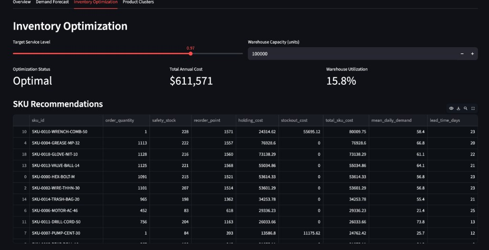
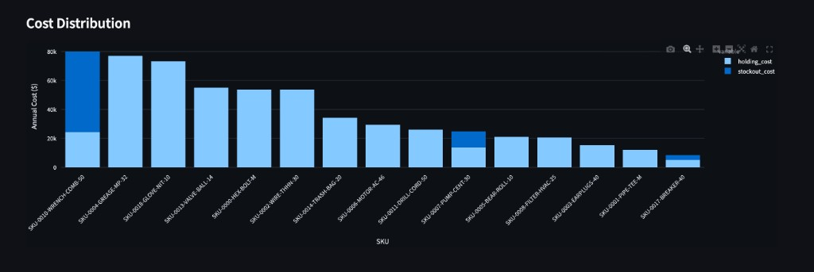
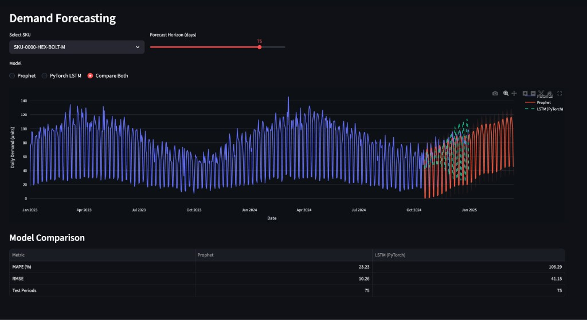
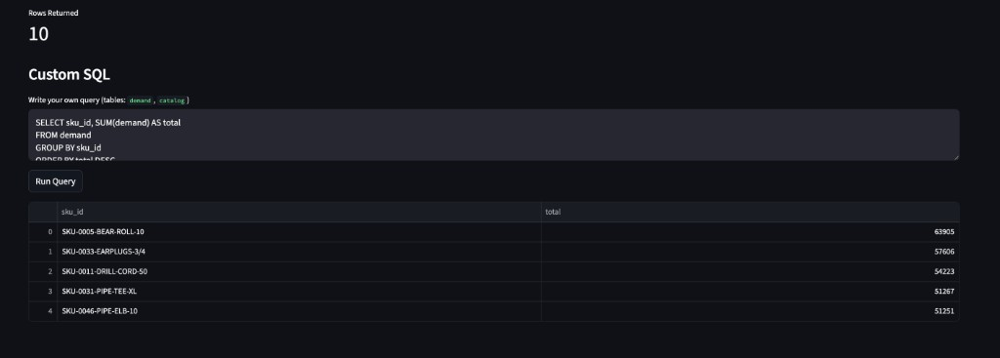
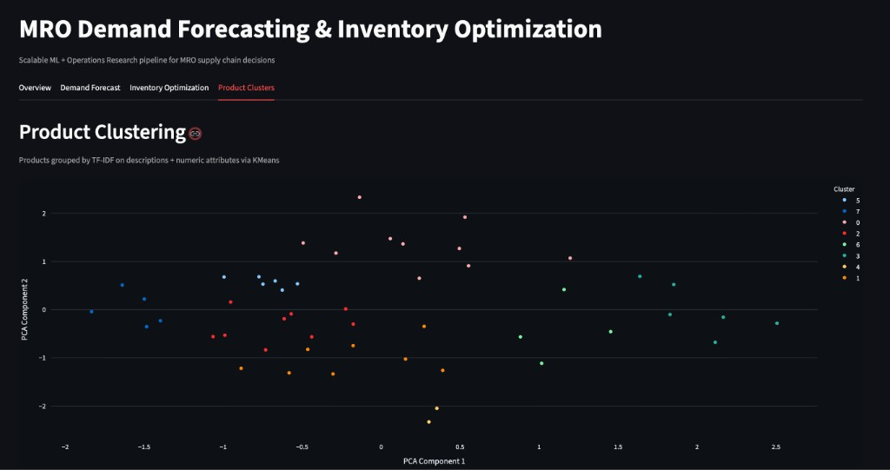
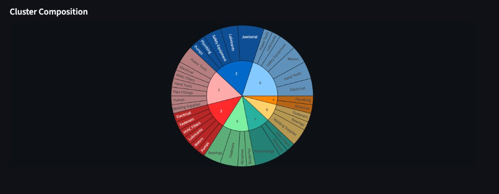

# MRO Demand Forecasting & Inventory Optimization

End-to-end machine learning + operations research pipeline for maintenance, repair, and operating (MRO) supply chain optimization. Combines time series demand forecasting with linear programming-based inventory optimization to minimize costs while maintaining target service levels.

## Architecture

```
Data Ingestion → ETL Pipeline → Product Clustering → Demand Forecasting → Inventory Optimization → Serving
  (Parquet)      (PySpark)     (TF-IDF + KMeans)      (Prophet)            (PuLP LP)          (FastAPI + Streamlit)
```

### Pipeline Flow

```
┌─────────────┐    ┌──────────────┐    ┌──────────────┐
│  Raw Data   │───▶│  ETL / Spark │───▶│  Feature     │
│  (Parquet)  │    │  Transform   │    │  Table       │
└─────────────┘    └──────────────┘    └──────┬───────┘
                                              │
                   ┌──────────────┐           │
                   │   Product    │◀──────────┤
                   │   Clustering │           │
                   └──────────────┘           ▼
                                       ┌──────────────┐    ┌──────────────┐
                                       │   Prophet    │───▶│  Inventory   │
                                       │   Forecast   │    │  LP Optimizer│
                                       └──────────────┘    └──────┬───────┘
                                                                  │
                                              ┌───────────────────┤
                                              ▼                   ▼
                                       ┌──────────────┐    ┌──────────────┐
                                       │   FastAPI    │    │  Streamlit   │
                                       │   Endpoints  │    │  Dashboard   │
                                       └──────────────┘    └──────────────┘
```

## Dashboard Screenshots

### Pipeline Overview


### Demand Forecasting




### Inventory Optimization (Linear Programming)




### Model Comparison (Prophet vs PyTorch LSTM)


### SQL Analytics (DuckDB)


### Product Clustering




## Key Components

### 1. ETL Pipeline (`src/etl/`)
- **Ingest**: Loads structured (transactions) and unstructured (product descriptions) data from Parquet files. Supports both pandas and PySpark backends.
- **Transform**: Calendar features, lag features (1/7/14/28 day), rolling statistics (7/14/30 day mean/std), joined with product metadata.
- **Cluster**: TF-IDF vectorization of product descriptions + numeric attributes, grouped via KMeans for demand segmentation.

### 2. Demand Forecasting (`src/models/forecaster.py`)
- Prophet-based time series forecasting per SKU with automatic trend/seasonality detection.
- Configurable forecast horizon (7-90 days) with prediction intervals.
- Evaluation via MAPE and RMSE on held-out test windows.

### 3. Inventory Optimization (`src/models/optimizer.py`)
- **Linear programming** (PuLP) to minimize total cost = holding cost + stockout penalty.
- Constraints: warehouse capacity, minimum service level (safety stock).
- Outputs: optimal reorder point, safety stock, and order quantity per SKU.
- Also supports closed-form EOQ for single-SKU quick optimization.

### 4. Serving Layer (`src/serving/`)
- **FastAPI**: REST endpoints for `/forecast`, `/optimize`, `/skus`, and `/health`.
- **Streamlit Dashboard**: Interactive tabs for demand visualization, optimization recommendations, cost breakdowns, and product cluster exploration.

### 5. Orchestration (`dags/`)
- Airflow DAG definition with task dependencies: `ingest → transform → cluster → [forecast, optimize] → health_check`.
- Scheduled daily at 6:00 AM UTC with retry logic.

## Quick Start

### Prerequisites
- Python 3.11+
- Docker (optional)

### Local Setup

```bash
# Clone and install
git clone https://github.com/your-username/mro-demand-optimizer.git
cd mro-demand-optimizer
pip install -r requirements.txt

# Generate synthetic MRO data
python -m src.utils.data_generator

# Run the API
uvicorn src.serving.api:app --reload --port 8000

# Run the dashboard (in a separate terminal)
streamlit run src/serving/dashboard.py
```

### Docker

```bash
docker-compose up --build
# API: http://localhost:8000
# Dashboard: http://localhost:8501
```

### API Usage

```bash
# Health check
curl http://localhost:8000/health

# List SKUs
curl http://localhost:8000/skus

# Forecast demand for a SKU
curl -X POST http://localhost:8000/forecast \
  -H "Content-Type: application/json" \
  -d '{"sku_id": "SKU-0000-HEX-BOLT-M", "horizon_days": 30}'

# Optimize inventory for a SKU
curl -X POST http://localhost:8000/optimize \
  -H "Content-Type: application/json" \
  -d '{"sku_id": "SKU-0000-HEX-BOLT-M", "service_level": 0.95}'
```

## Testing

```bash
pytest tests/ -v
```

## Tech Stack

| Layer | Tools |
|-------|-------|
| Data & ETL | PySpark, Pandas, Parquet |
| ML | Prophet, scikit-learn, NumPy |
| Optimization | PuLP (Linear Programming) |
| Serving | FastAPI, Streamlit, Plotly |
| Orchestration | Airflow / Astronomer |
| Infrastructure | Docker, GitHub Actions CI/CD |
| Cloud-Ready | AWS (S3, SageMaker, ECS) |

## Project Structure

```
mro-demand-optimizer/
├── .github/workflows/ci.yml    # GitHub Actions CI pipeline
├── dags/
│   └── demand_pipeline_dag.py  # Airflow DAG
├── data/synthetic/             # Generated MRO data
├── src/
│   ├── etl/
│   │   ├── ingest.py           # Data loading (pandas + Spark)
│   │   ├── transform.py        # Feature engineering
│   │   └── cluster.py          # Product clustering
│   ├── models/
│   │   ├── forecaster.py       # Prophet demand forecasting
│   │   └── optimizer.py        # PuLP inventory optimization
│   ├── serving/
│   │   ├── api.py              # FastAPI endpoints
│   │   └── dashboard.py        # Streamlit dashboard
│   └── utils/
│       ├── data_generator.py   # Synthetic MRO data
│       └── metrics.py          # Evaluation metrics
├── tests/
├── Dockerfile
├── docker-compose.yml
└── requirements.txt
```
